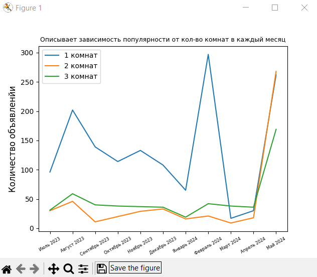

# Анализ графика

Анализируя полученные результаты можно увидеть, как меняется количество доступных квартир в зависимости от их комнатности. Например, можно обнаружить, что квартиры с большим количеством комнат обычно менее популярны и имеют меньшее количество активных объектов, чем квартиры с меньшим количеством комнат. Это может быть связано с тем, что квартиры с большим количеством комнат более дорогостоящие и требуют больших затрат на обслуживание.

Также на графике можно выявить сезонные или временные тренды, например, пик активности квартир определенной комнатности в определенные месяцы
